## Hi there 👋,I'm JinKang
I love to talk on trending ⚡ technology ⚡, stay hungry

<h3> 👨🏻‍💻 &nbsp;About Me </h3>

- 🤔 &nbsp; Exploring new technologies and developing software solutions and quick hacks.
- 🌱 &nbsp; Learning more about Function Compute, Cloud Architecture, and Artificial Intelligence
- 📚 &nbsp; Enjoying reading and accumulating knowledge
- 📖 &nbsp; Novels: *《剑来》* and *《雪中悍刀行》*
- 📺 &nbsp; Cartoon: *One Piece* and *《一人之下》* and *《星游记》*

[
]()

### 🍉 Tech Stack

### 🔨 Tools I Use

### 🍏 Contact 
- Email：2385472291@qq.com
- 掘金：https://juejin.cn/user/4224735995759975
- CSDN：https://blog.csdn.net/m0_56132701
- 微信公众号：https://mp.weixin.qq.com/s/5flPF92JcI4bInMQKlDujA - 《RAG策略》
