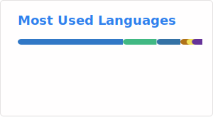
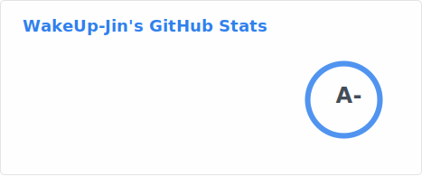

## Hi there 👋,I'm JinKang
I love to talk on trending ⚡ technology ⚡, stay hungry

<h3> 👨🏻‍💻 &nbsp;About Me </h3>

- 🤔 &nbsp; Exploring new technologies and developing software solutions and quick hacks.
- 🌱 &nbsp; Learning more about Function Compute, Cloud Architecture, and Artificial Intelligence
- 📚 &nbsp; Enjoying reading and accumulating knowledge
- 📖 &nbsp; Novels: *《剑来》* and *《雪中悍刀行》*
- 📺 &nbsp; Cartoon: *One Piece* and *《一人之下》* and *《星游记》*

[
]()

### 🍉 Tech Stack

### 🔨 Tools I Use

### 🌴 Building Now
- 🌈 [大模型应用开发 -上下文工程与运行空间实践指南](https://github.com/WakeUp-Jin/Practical-Guide-to-Context-Engineering) - 上下文工程是设计原则，Agent Harness 是构建目标
- 🪐 [Actspace Agent](https://github.com/WakeUp-Jin/actspace-agent) - 是一个为 DeepSeek 打造的本地 Agent 桌面应用，通过 Agent Harness 让 DeepSeek 获取更多上下文、做更多事情
- 🍍 [agent-harness-dev](https://github.com/WakeUp-Jin/agent-harness-dev) - 一份构建Agent后端的Skill，从Context Engineering与Harness Engineering的设计理念整理出来的
- 🚄 [code-develop-harness-init](https://github.com/WakeUp-Jin/code-develop-harness-init) - 面向 Agent-first 开发的项目初始化模板（Harness）—— 人定方向，Agent 执行
- 🎶 [音频制作Agent](https://github.com/WakeUp-Jin/reasonVoiceAgent-introduction) - AI 驱动的音频创作协同平台 —— 让 AI 智能体帮你完成配音、音效、BGM 的智能匹配与生成
- 🌵 [Reason Code](https://github.com/WakeUp-Jin/reason-code) - Reason Code 是一款编码Agent，它集成于终端环境中

### 🍏 Contact 
公众号「锦康灵感铺」 · 微信号「a2385472291」 · 2385472291@qq.com · [稀土掘金](https://juejin.cn/user/4224735995759975) · [小红书](https://www.xiaohongshu.com/user/profile/5f2b55730000000001005a90)
